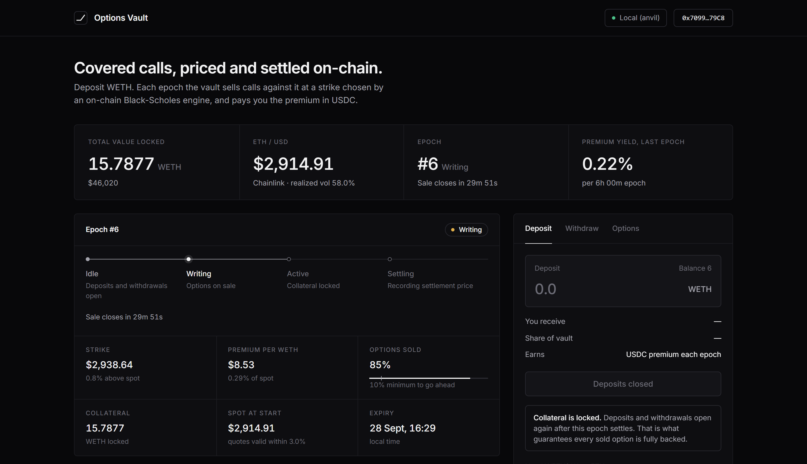
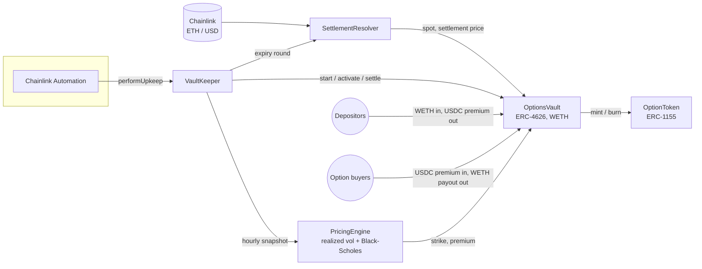

# Options Vault

A covered-call vault on Arbitrum that runs entirely on-chain. It prices its own options with a
fixed-point Black-Scholes engine, using a realized-volatility estimate it keeps itself, and settles
against Chainlink with no discretion left to anyone.

Depositors supply WETH. Each epoch the vault sells ~30-delta calls against that WETH and pays
the premium to depositors in USDC. The contract computes the strike and the premium from spot and
realized vol. No off-chain quote, no market maker and no admin sets the price.

> **Testnet only. Not a financial product.** Reviewed by its authors and heavily tested, but not
> audited by a third party. See [Trust assumptions](#trust-assumptions) and
> [Known limitations](#known-limitations).

[](https://github.com/Natgoh88/options-vault/actions/workflows/ci.yml)



<sub>Local test run with the real contracts and keeper. More: [payoff chart](docs/images/02-payoff-chart.png), [on-chain Greeks](docs/images/03-greeks.png), [epoch history](docs/images/04-epoch-history.png).</sub>

## Why this is not just Dopex

Dopex SSOVs use the same covered-call shape, and they work. The difference is where the price comes
from. Here the **pricing is the product**. The contract implements Black-Scholes itself, in
`SD59x18` fixed point: the normal CDF, the strike solve for a target delta, and all five Greeks. It
also maintains its own realized-volatility estimate from oracle snapshots. Every premium can be
traced back to a formula and a state anyone can read, with a stated error bound. That math is what
this project defends under review; the vault around it is deliberately conventional.

## Architecture



| Contract | Role |
|---|---|
| [`OptionsVault`](src/OptionsVault.sol) | ERC-4626 over WETH. Epoch state machine, collateral, USDC premium accumulator, payouts. |
| [`PricingEngine`](src/PricingEngine.sol) | Realized vol (O(1) ring buffer) and Black-Scholes price, delta, Greeks, and strike-for-delta. Holds no funds. |
| [`OptionToken`](src/OptionToken.sol) | ERC-1155 option positions, one id per (strike, expiry). Only the vault mints and burns. |
| [`SettlementResolver`](src/SettlementResolver.sol) | Checked Chainlink spot; the deterministic settlement price per epoch. |
| [`VaultKeeper`](src/VaultKeeper.sol) | One Chainlink Automation upkeep: vol snapshots and the whole epoch lifecycle. |

## How an epoch works

```
Idle ──startEpoch──▶ Writing ──activate──▶ Active ──beginSettlement──▶ Settling ──settle──▶ Idle
 │ deposits and        │ options on sale     │ collateral locked        │ price recorded
 │ withdrawals open    │ at a fixed price    │ until expiry             │ payouts reserved
 │ (≥ idleWindow)      │                     │                          │
 └─────────────────────┴── under minFillBps sold: cancelled, premium refunded, back to Idle
```

1. **Start (keeper only).** The contract reads spot and realized vol. It solves for the strike
   whose delta is 0.30, prices the call, adds a safety markup and rounds up. Strike and premium are
   then **fixed for the epoch**.
2. **Writing.** Anyone buys options in USDC, up to the WETH collateral. Purchases revert if spot has
   moved more than `maxSpotDeviationBps` since the start, so no one can buy a stale quote.
3. **Activate (permissionless).** Once sold out or the window closes, the epoch goes live. If less
   than `minFillBps` of the collateral sold, it is **cancelled** instead: depositors are released
   immediately and buyers reclaim their premium. A dust purchase cannot lock the vault.
4. **Settle (permissionless).** The settlement price is the **last Chainlink round at or before
   expiry**. It is not a spot read at trigger time, so nothing in the settlement transaction can
   move it. Each option pays `(price − strike) / price` WETH, rounded down. That total is reserved
   and excluded from depositors' assets.
5. **Idle.** An exit window of at least `idleWindow` before the next epoch. Premium accrues per
   share and is claimable at any time.

## The pricing engine

| | |
|---|---|
| Price | `C = S·N(d1) − K·e^(−rT)·N(d2)`, in PRBMath `SD59x18` |
| Normal CDF | Abramowitz & Stegun 26.2.17, absolute error ≤ 7.5e-8 |
| Price error | ≤ (S + K·e^(−rT)) · 7.5e-8, about $0.0003 at S = K = $2,000 |
| Strike solve | bisect on d1, then `K = S·exp((r + σ²/2)T − d1·σ√T)`; no bracket, about 0.5M gas |
| Greeks | delta, gamma, vega, theta, rho from the same d1/d2 (`callGreeks`) |
| Realized vol | `σ² = Σr² / Σdt`: each return weighted by its real time gap, clamped to [min, max] |

The tests check this against exact references rather than trusting it. `script/gen_vectors.py`
produces 400 cases with the exact CDF (`math.erfc`, the same function as `scipy.stats.norm.cdf`),
covering price, delta and all four other Greeks. Every tolerance in the tests is **derived from the
stated error bound**, not picked. Property fuzzing covers monotonicity in spot, strike and vol,
no-arbitrage bounds, CDF symmetry, strike-solve round trips, and finite-difference Greeks.

## Security

- **[Security report](docs/security-report.md):** scope, tool runs, triage of every static-analysis
  finding, the manual checklist, and the findings log.
- **Design audits:** [before Phase 4](docs/pre-p4-audit.md) (14 fixes) and
  [after Phase 5](docs/post-p5-audit.md) (6 fixes, including a vault-locking griefing attack).
- **Exploit tests** for each real finding: oracle manipulation at settlement, cherry-picked rounds,
  reentrancy through the ERC-1155 hook, ERC-4626 inflation, dust-purchase griefing.
- **Mutation-checked:** breaking the payout formula, the reentrancy guard, the minimum-fill check or
  the keeper guard makes the suite fail.
- **Invariants:** 8 properties run at 256 runs on every push, and 50,000 runs (3.2M calls) nightly.
- Slither runs on every push (fails on High) and Aderyn runs in CI. Line coverage of `src/` is 100%.

## Trust assumptions

- **Chainlink ETH/USD** reports honestly within its heartbeat. The design removes discretion and
  same-transaction manipulation, not oracle compromise.
- **The keeper** can start epochs and take vol snapshots, but only when the contracts say it is
  due. It cannot choose the strike, the premium or the settlement price, and cannot move funds.
  Every lifecycle step except `startEpoch` is also permissionless.
- **The owner** (`Ownable2Step`) can only rotate the vault's keeper. There are no upgrades, no
  pause and no fee switch.

## Known limitations

- **Model risk.** Realized vol is not implied vol. The vault can sell options too cheaply and lose
  money in a volatile epoch. The markup is a cushion, not a guarantee.
- **Whole-balance lock.** All WETH is locked for the epoch even if only part of it sold, above the
  minimum fill. The unsold part earns nothing.
- **CDF approximation.** Prices carry the bounded error above; it is stated, not hidden.
- **Oracle outage.** If the feed was stale at expiry, settlement waits for `fallbackDelay`. It then
  uses the same deterministic round rather than refusing forever.
- **USDC.** Premium is paid in USDC, so a depeg or blacklist affects premium claims, not collateral.
- **Testnet.** The demo profile compresses an epoch to about 7 hours and uses a faucet `TestUSDC`.

## Repository

```
src/            contracts (+ interfaces/, testnet/TestUSDC.sol)
test/           unit, fuzz, invariant, exploit and deploy-script tests; vectors/ = reference data
script/         Deploy.s.sol, gen_vectors.py, keeper-once.sh
frontend/       Vite + React + viem app (Inter, no wallet-kit), deployable to Vercel
docs/           security report, design audits, deployment guide, demo script, contest brief
```

## Running it

```bash
git clone --recurse-submodules https://github.com/Natgoh88/options-vault.git
cd options-vault
forge build && forge test                     # 126 tests
FOUNDRY_INVARIANT_RUNS=50000 forge test --match-path test/OptionsVault.invariant.t.sol
cd frontend && npm install && npm run dev
```

To deploy to Arbitrum Sepolia, register the keeper, host the frontend, or run everything against
a local chain, see **[docs/deployment.md](docs/deployment.md)**.

## Status

| Phase | |
|---|---|
| 0 Setup | ✓ repo, interfaces first, CI |
| 1 Pricing engine | ✓ Black-Scholes, CDF, vol, Greeks, 400 reference vectors |
| 2 Vault + token | ✓ ERC-4626 / ERC-1155, invariants |
| 3 Oracle + settlement | ✓ deterministic expiry round, Automation keeper |
| 4 Security pass | ✓ Slither, Aderyn, exploit tests, report |
| 5 Frontend + deploy | ✓ app, deploy script; the testnet broadcast and Vercel publish need the deployer's wallet |
| 6 Polish | ✓ docs, audit report, [demo script](docs/demo-script.md), [contest brief](docs/contest-brief.md) |

Built by two people, from the plan in [`docs/action-plan.md`](docs/action-plan.md). MIT licensed.
